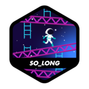

# 💫 About Me:
 

👩🏻‍💻 I'm currently working on developing my own Bash script and building projects in C;   
❓ I'm looking for help with selecting the next programming language to learn and exploring the field of cybersecurity;  
🇨 I'm currently learning C and preparing to dive into C++; Ask me about switching careers from Cultural Production to Software Engineering, or my experience studying at 42|Rio;  
🤠In my free time, I enjoy listening to music and dancing, which helps me unwind and stay creative;  
🦭 My long-term dream is to combine my skills in technology with my love for animals, possibly by developing tech solutions that support vegan causes and animal welfare;  
🨠What I bring to the table is a unique blend of creativity from my background in Cultural Production and the technical skills I’m developing in Software Engineering, all driven by a strong sense of purpose in advocating for animal rights. <be>

## 🌐 Socials:
 

 

# 💻 Tech Stack:

# 📊 GitHub Stats:

  
  
  

## 🏆 GitHub Trophies

  

## 📓 Software Engineering Projects

  
   
  
  
  
  
   
  
   
  
  
  
  
  
  
   
  <h3> ⚙️  Net Practice and CPP Pool is still in progress: 🛠️ </h3>
  
<!--  <h3> ⚙️ This README is currently under construction. Please check back soon for updates. 🛠️ </h3> -->

<!---->

### ✍️ Random Dev Quote

  

<!--### 🔝 Top Contributed Repo

  

-->

---

<!-- Proudly created with the help of GPRM ( https://gprm.itsvg.in ) and of Profile Readme Generator ( https://profile-readme-generator.com/ ) -->
